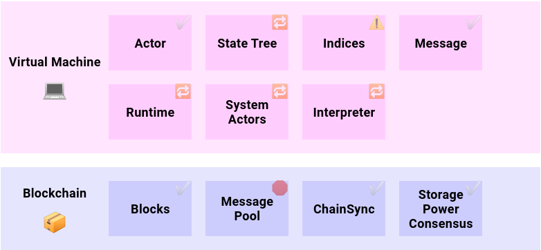

#### 前世今生
说到Lotus, 恐怕要从IPFS说起。IPFS全称InterPlanetary File System，是一个旨在创建持久且分布式存储和共享文件的网络传输协议，在IPFS网络中的节点将构成一个分布式文件系统。它是一个开放源代码项目，由Protocol Labs（协议实验室）在开源社区的帮助下发展。
要构造IPFS协议为基础的分布式存储网络，需要大量节点加入。可天下毕竟没有免费的午餐，要壮大这个网络，引入激励层势在必行。这就引出了Filecoin的诞生。
Filecoin最早的一个实现是go-filecoin项目，原来预计的第一阶段测试网将基于这个实现。熟悉协议实验室的都知道他们的风格，go-filecoin毫无悬念的跳票了，lotus项目就在这样的背景下诞生了。

#### 项目共识
上一节也说过，Filecoin是IPFS的激励层。如果Filecoin满足激励有效、存储安全、体验优秀等特点，可以预计将会有许多资本会进入这个项目，Filecoin将会成为一个具有成熟商业模型的项目。Filecoin项目的总体架构也需要围绕这些目标进行设计。在分析lotus的架构时，我们需要凝聚一下项目的共识。

###### 角色
- chain
- block miner
- storage miner
- storage client
###### high level业务流

#### 链

#### 存储
