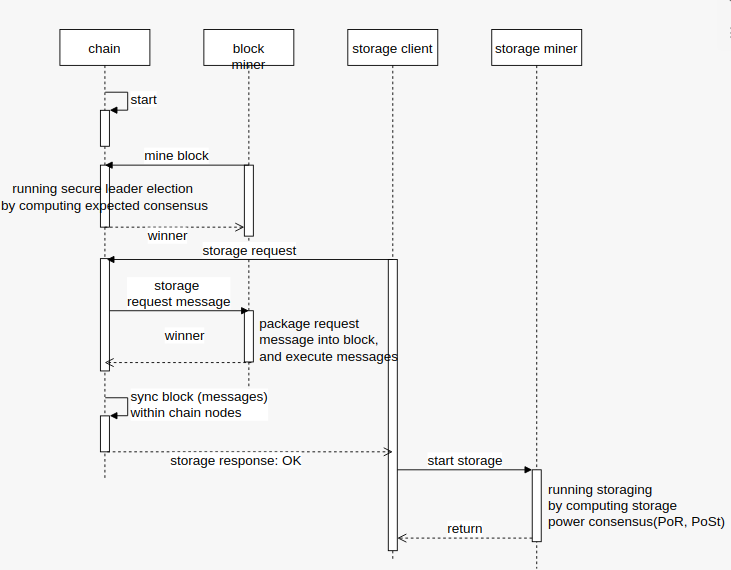

#### 前世今生
说到Lotus, 恐怕要从IPFS说起。IPFS全称InterPlanetary File System，是一个旨在创建持久且分布式存储和共享文件的网络传输协议，在IPFS网络中的节点将构成一个分布式文件系统。它是一个开放源代码项目，由Protocol Labs（协议实验室）在开源社区的帮助下发展。
要构造IPFS协议为基础的分布式存储网络，需要大量节点加入。可天下毕竟没有免费的午餐，要壮大这个网络，引入激励层势在必行。这就引出了Filecoin的诞生。
Filecoin最早的一个实现是go-filecoin项目，原来预计的第一阶段测试网将基于这个实现。熟悉协议实验室的都知道他们的风格，go-filecoin毫无悬念的跳票了，lotus项目就在这样的背景下诞生了。

#### 项目
上一节也说过，Filecoin是IPFS的激励层。如果Filecoin满足激励有效、存储安全、体验优秀等特点，可以预计将会有许多资本会进入这个项目，Filecoin将会成为一个具有成熟商业模式的项目。Filecoin项目的总体架构也需要围绕这些目标进行设计。

在开始探讨具体的技术问题之前，有几个关键问题我们要搞清楚：
- high-level 业务流
- 怎么达到激励的目的
- 如何保证存储的安全性

###### high level业务流

如上图所示，系统中参与者有storage client、storage miner、block miner、chain等角色。
在chain的每个epoch，block miner们会参与Secure Leader Election，选举完成以后，winner们就可以把发送过来的各种messages，包括storage request message进行打包成为block并执行，新的block随后被同步到网络上的其他节点。storage miner收到storage request以后，进行存储，并生成PoSt存储证明。

###### 怎么达到激励的目的
俗话说，无利不起早。要让资本进入这个项目，得让资金有所回报。Filecoin项目的数字货币为FIL，按照白皮书，70%的FIL会奖励给参与这个项目的矿工，其中包括区块挖掘奖励和数据储存奖励等。

###### 如何保证存储的安全性
- 区块挖掘的安全性
	所有参与挖矿的节点都会参与被称为Expected Consensus的链共识，运行Secure Leader Election，被选举出的Leader(们)都有权创建新的block，并加入当前高度的tipset。 
	EC共识采用VRF生成随机数，采用PoSt算法生成可验证的区块证明，并在之后的链周期进行验证，来解决block mining中的安全风险。
	
- 数据存储的安全性
  当storage miner通知storage client说已经成功存储完数据，storage client怎么知道对方真实的存储了数据呢？系统采用了几个方法
  - 在存储数据完成以后，storage miner需要使用PoSt生成数据已经存储的证明。
  - 在存储完成之后的数个周期内，需要一直对此次存储进行证明。只有经过证明的存储，才可以拿到相应部分的存储挖矿奖励。

#### 结语
这篇文章对Lotus做了一个介绍，对于整个系统的通用架构语言有一些了解。这样，在下面介绍和讨论具体技术的时候，可以更好的沟通。