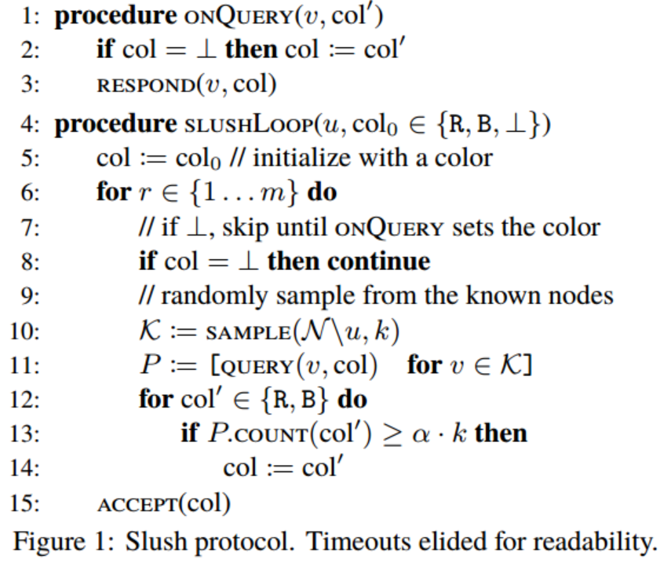
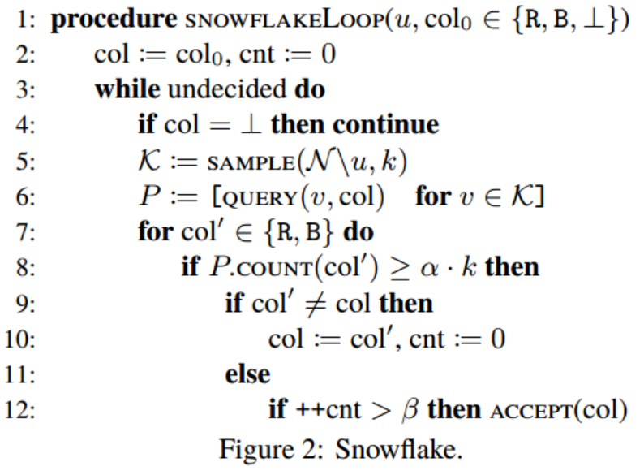
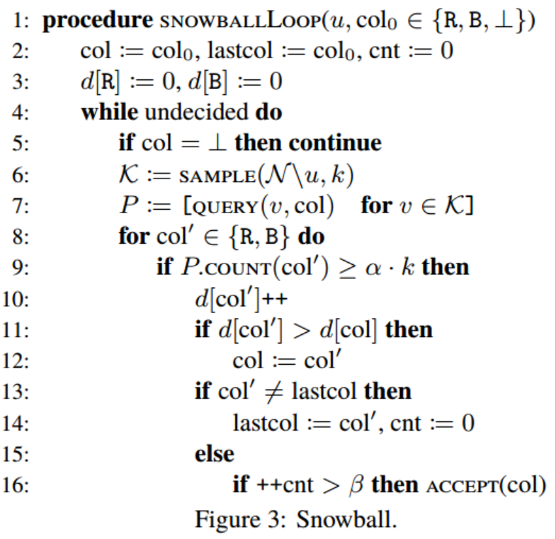
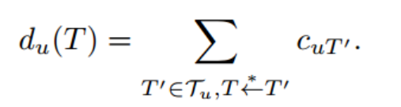
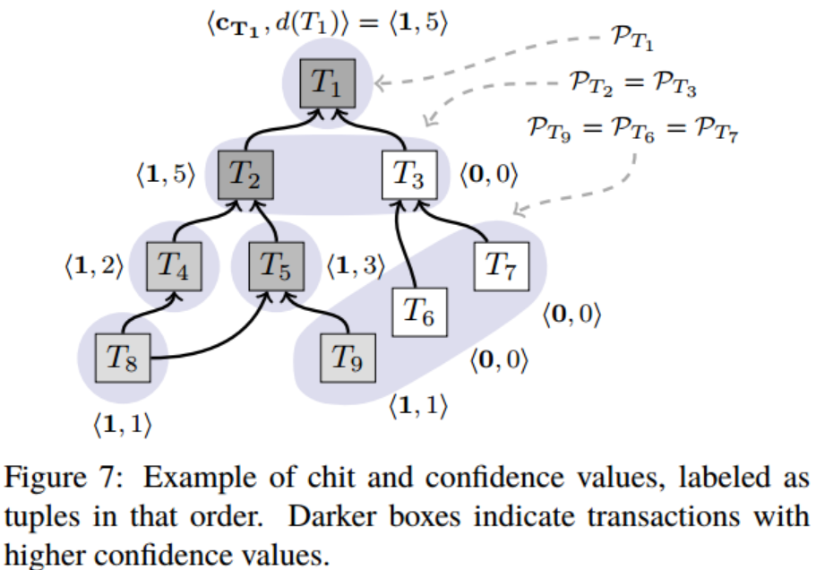
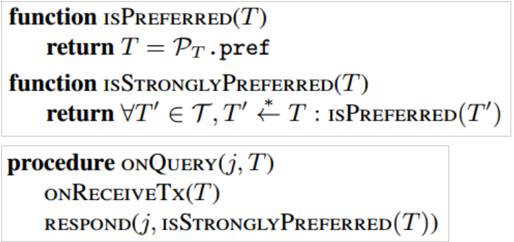
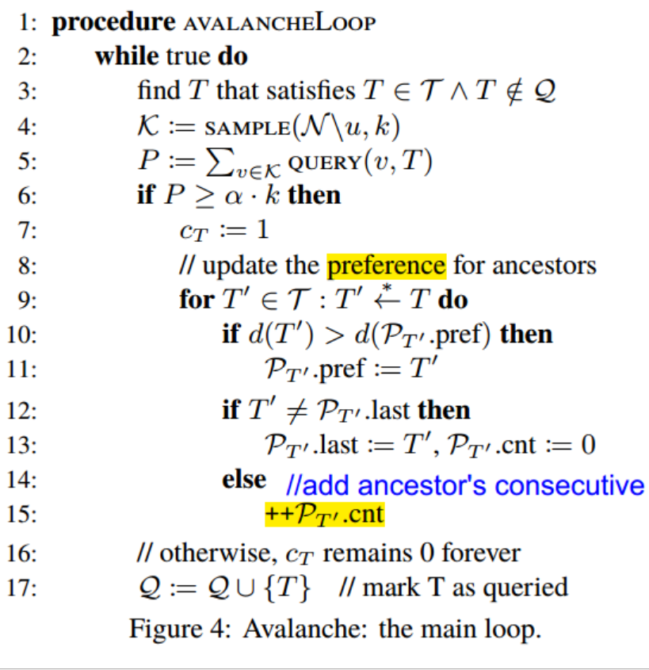
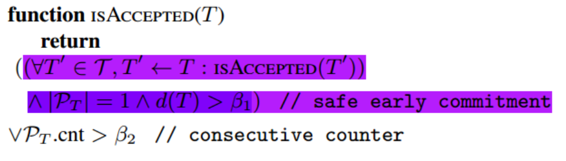
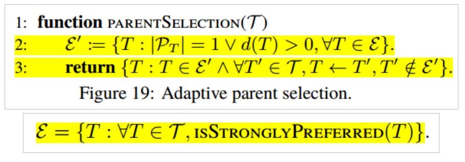

# 
Avalanche共识协议 - 学习笔记

## 解决什么问题
#### 共识协议及其缺陷
共识协议有古典共识协议，PoW，PoS等。
- 古典共识协议：网络通信量大 
- PoW：成本高，资源消耗型算法 
- PoS： 非公平算法，共识结果主要取决于节点资本的多寡

## 方案
协议族包含四个协议：slush，snowflake，snowball，avalanche。

#### 四个协议之间的关系
- Slush协议是基础协议，反应了协议族的基本工作原理
- snowflake/snowball协议基于slush协议进行了改进，增强了系统的安全性/活性
- avalanche协议是最终协议，也是协议族中的核心协议，综合了前三种协议的优点长处。

#### Slush协议

###### 协议原理
- 所有节点最初是 uncolored 状态
- 当节点收到一个 client 发来的交易请求之后，它就立刻把自己变成 tx 中设置的 color，同时发起一笔 query。
	- 执行 query 时，节点会随机选择一个相对小的节点样本 k，向他们发出 query。
	- 如果是 uncolored 的节点收到 query，那么就染色，并回复 color。同时还会发起一个 query（也就是 Gossip）。
	- 如果是已经 colored 的节点收到 query，那么就回复自己已染的 color。
	- 如果没有在限定时间内收到 k  个响应，那么节点就会从（之前 sample 后）剩余节点中继续选择一些节点发出 query。直到收集到所有 k  个 响应。
	- 一旦收集到 k 个响应，就判断是否能存在一个同颜色/总颜色的比率 fraction ≥ αk，α > 0.5，它是一个协议参数（protocol parameter）。 如果 αk 阈值（threshold）满足，并且sampled color 跟节点自身的 color 不一样，那么节点就会把自己的 color 变成 sampled color。然后，继续回到 query 步骤，发起新一轮的 query，总共发起 m 轮。最终，节点会在 m 时间期限内决定最终的 color。

###### 协议特点
- Gossip协议同步数据
- 随机扰乱，生成数据偏差
- 反复抽样，放大数据偏差

#### Snowflake协议

###### 协议原理
- 在查询节点增加了一个counter，用以记录某颜色col持续查询成功的轮次数
- 设置初始颜色为col并查询，若查询节点本次查询的k个被查询节点中，有超过α\*k个被查询节点回应，且：回应颜色等于col，则counter++；若回应颜色不等于col，则counter清零
- 当counter值超过阈值β时，表明该颜色col是被接受的，查询成功

###### 协议特点
通过设置持续查询成功计数器和阈值β，改变了Slush协议中只判断第m轮结果颜色的不合理方式，增加了系统的Safety

#### Snowball 协议
###### 协议原理
- 系统增加了一个置信度计数器，用来记录各颜色查询成功的次数
- 系统当前颜色为置信度高的颜色

###### 协议特点
- 通过改变判断当前颜色的机制，将某次查询触发当前颜色改变，改为全局置信度触发，增强了系统的Safety。（Snowflake协议中，当此次查询成功的颜色与上次不同时，即改变当前颜色；Snowball协议中，选择置信度高的颜色为当前颜色。）

#### Avalanche协议
###### 协议原理
- 抽象出DAG结构，这是由交易组成的有向无环图
- 增加了冲突集的概念。冲突集表示集合内的交易是互相冲突的，即存在双花问题。不存在双花问题的交易节点，其冲突集内只有该节点。
- 用二元组表示节点u的(chit, confidence)，chit表示一轮抽样中交易T在节点u上收到Yes返回值，confidence表示交易T的置信度，confidence的值等于其所有子孙节点的chit值之和

- DAG结构如图

- 节点u随机选择k个被查询节点，查询对象是待查询交易T以及DAG中T->T'路径上的每个交易。当被查询节点对所有交易都满意，即每个交易在该节点上是交易冲突集中的preferred时，该节点返回Yes;否则返回No。

- 节点u收集到αk个Yes回复后，设置Cu(T)=1，并更新T->T'路径中的所有节点的d(T')值和冲突集中的preferred值。

- 交易T被接受的条件是：
	- 第一种方式，需满足三个条件：T->T'路径上的所有交易都是可被接受的；T的冲突集中只有T； 交易置信度d(T)>β1；
	- 第二种方式：冲突集ρ(T)内，交易T的持续查询成功计数器ρ(T).cnt>β2；

第一种方式针对普通诚实交易，条件1将当前交易T与祖先交易集捆绑，只有当祖先交易集的所有交易都可被接受，T才可以被接受，增强了系统的安全性；条件2要求这是一个普通诚实交易，不与其他交易存在冲突；条件3要求交易的置信度达到阈值β1；这种方式也被称为“早期安全提交(safe early commitment)”。
当一个诚实交易因为祖先集的liveness原因不能被接受，可以为该交易重新选择父节点。
第二种方式包含了所有交易，只要交易T被持续成功查询次数达到阈值β2，即可接受。对于一个非诚实交易来说，随机取样与连续取值决定了其被接受的概率非常的低。

- DAG中，新交易T选择父节点的策略
	- 目的：构筑一个良好DAG结构，最终使得诚实交易会被快速接受
	- 原则：1）维护一个良好的DAG形态，保持稳定的宽度，提供足够的并发性；2）不能影响系统的安全性
	- 思路：计算有效候选集，从中随机选出父节点。
	- 方法：从DAG前沿顶点（不含）到创世顶点（不含），沿着IsStronglyPrefered(T)算法一路寻找，不考虑d(T)=0的顶点或冲突集中交易数>1的顶点，找到父顶点候选集，然后随机从中选取父节点。

###### 协议特点
- 核心最终协议
- 以极高的概率保证：诚实的交易最终会被正常节点接受，不诚实的交易（冲突交易）不会被接受
- 绿色环保，不消耗能源
- 并行共识模型 - 传统RSM模型是每个客户端运行RSM模型并保持全序交易队列，本算法中每个客户端独立地与自己的RSM交互，并在依赖交易中建立偏序关系

#### 安全性分析
###### 双花攻击与防范
- 双花攻击的原理：交易的一个输出被作为另一个交易的输入两次或两次以上
- 防范措施：将构成双花的交易组成一个冲突集，对冲突集内的交易，通过抽样选举，选择出一个置信度高或持续选举成功的交易予以接受。

###### Sybil攻击与防范
- Sybil攻击的原理：恶意节点伪造多重合法身份，利用这些身份对信息进行截取，篡改，传播，从而达到逆反共识的目的。
- 防范措施：通过投注AVA代币股份来防止sybil攻击。这意味着节点需要拥有AVA代币，以表明他们在系统中拥有一些所有权。所以这里的投入股份只是为了确保你不能冒充别人。与以太坊和其他代币不同，这些股份不是抵押品，而是永远不会丢失的。如果你行为不端，你的钱也不会被扣走。股份投注不是用于达成共识，而事实上它完全独立共识。
